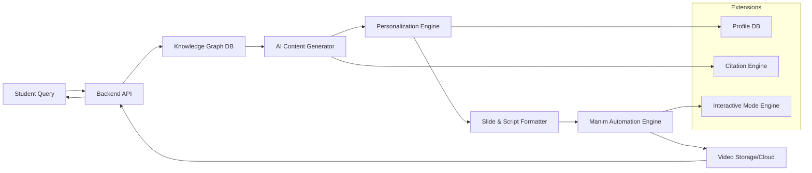

# AIQ Space Ventures – Technical Round Submission

## Problem Statement

**AI-Powered Knowledge Graph to Manim Animation Automation**
A system that automates creation of educational videos using AI and Manim. Students can query a knowledge graph of books to retrieve concepts. The AI then generates slides and scripts, which are converted into animated videos via Manim.

---

## 1. Thought Process

* **Why Knowledge Graph?**: Provides structured, semantic links between concepts (e.g., Dijkstra → Graphs → Algorithms → Applications). Ensures accurate retrieval instead of raw text search.
* **Why AI (LLM)?**: For dynamic generation of explanatory content tailored to the concept, learning level, and domain (GIS, Space Tech, DS/Algo).
* **Why Manim?**: Open-source Python library specialized for mathematical/educational animations. Perfect for automated, clean video creation.
* **Trade-offs Considered:**

  * Rich animations (Manim) vs Faster rendering (PowerPoint → Video)
  * Dynamic personalization vs Pre-rendered templates
  * AI LLM costs vs Static content quality

---

## 2. High-Level Architecture



---

## 3. Pseudocode (Key Modules)

### Query Handling

```pseudo
function handleQuery(query, userProfile):
    concept = KG.search(query)
    if concept == null:
        return "Concept not found"
    slides, script = AI.generate(concept, userProfile)
    formattedSlides = formatSlides(slides, script)
    video = ManimEngine.render(formattedSlides)
    store(video)
    return video.link
```

### AI Content Generation

```pseudo
function generate(concept, profile):
    textData = retrieveConceptData(concept)
    slides = LLM.summarizeToSlides(textData, profile.level)
    script = LLM.expandToNarrative(slides, profile.style)
    return slides, script
```

### Manim Rendering

```pseudo
function render(slides):
    for slide in slides:
        scene = Manim.createScene(slide.content)
        animate(scene)
    video = compileScenes()
    return video
```

---

## 4. Trade-offs

* **Knowledge Graph vs RDBMS:** KG offers semantic richness but higher complexity.
* **LLM vs Template Scripts:** LLM provides flexibility but risks hallucination; templates ensure consistency but are rigid.
* **Manim Automation vs Manual Videos:** Automation saves time, but quality may vary.
* **Cloud vs Local Storage:** Cloud scales better but increases costs.

---

## 5. Testing & Rollout Strategy

* **Unit Testing:** Each module (retrieval, AI script gen, formatter, rendering).
* **Integration Testing:** Ensure smooth flow end-to-end.
* **A/B Testing:** Compare personalized vs non-personalized videos.
* **Rollout:** Start with one domain (Data Structures), then expand to Space Tech, GIS.

---

## 6. Potential Risks

* **AI Hallucination:** Mitigation → cross-verify with KG citations.
* **Manim Failures:** Mitigation → predefined fallback templates.
* **High Latency:** Mitigation → async job queue, notify when video ready.

---

## 7. Troubleshooting

1. **Video generation fails (Manim errors):**

   * Check slide-to-scene mapping for unsupported LaTeX/graphics.
   * Use fallback static slide template instead of animation.
2. **AI script is irrelevant or incorrect:**

   * Cross-check with KG source text.
   * Add citation verification engine to highlight sources.
3. **Slow rendering or timeout:**

   * Switch to asynchronous job queue with status tracking.
   * Allow partial delivery (slides + script first, video later).
4. **Knowledge graph returns empty results:**

   * Expand query using semantic similarity search.
   * Suggest related topics instead of failing outright.
5. **Storage issues (full/overwrites):**

   * Enable versioning for outputs.
   * Auto-archive old videos to cold storage.

---

## 8. Extensions

* **Personalization:** Beginner/Intermediate/Advanced versions.
* **Interactive Mode:** Pause, tweak parameters (e.g., change graph input) and re-render scenes.
* **Voice Narration:** AI-powered TTS for accessibility.
* **Teacher Dashboard:** Batch-generate entire syllabus.

---

## 9. Repository Structure

```
repo/
│ README.md (this doc)
│ diagrams/ (Mermaid or exported PNGs)
│ pseudocode/ (modular pseudo implementations)
│ tradeoffs.md
│ troubleshooting.md
```

---

## 10. Conclusion

This design balances **automation, personalization, and scalability** to deliver AI-powered animated educational content. The inclusion of citations, troubleshooting, and interactive features ensures quality, trust, and engagement.
